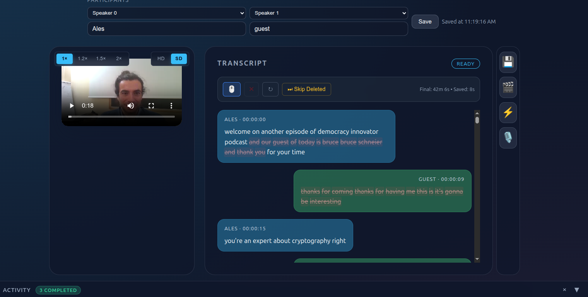
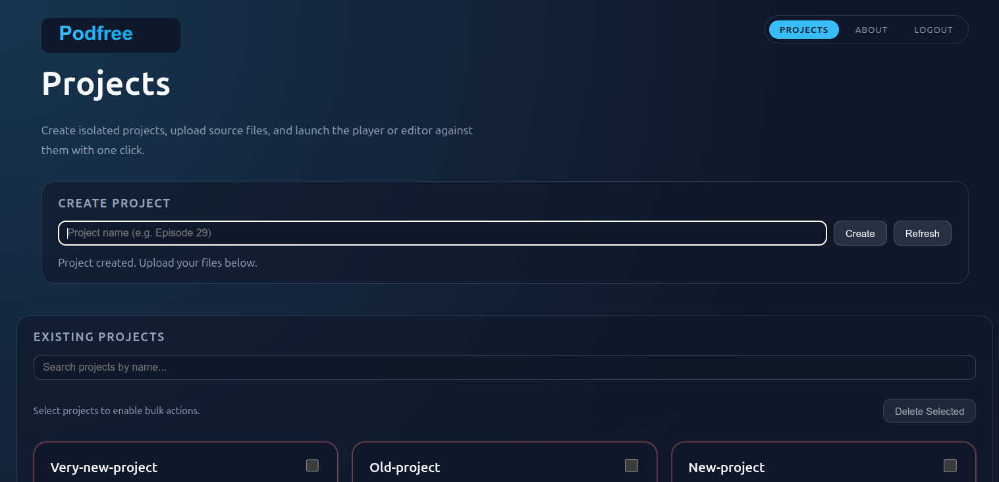
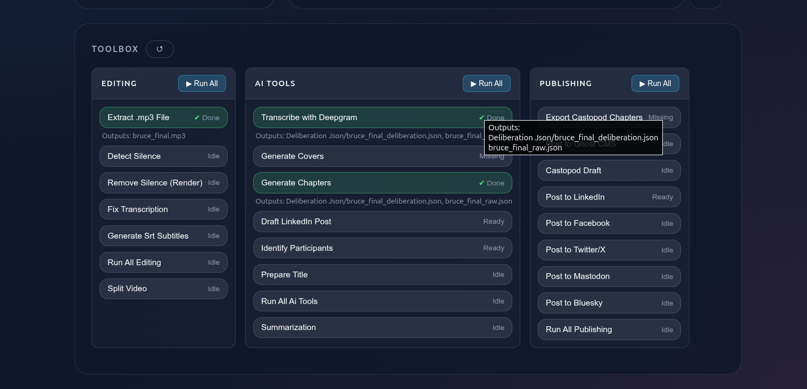
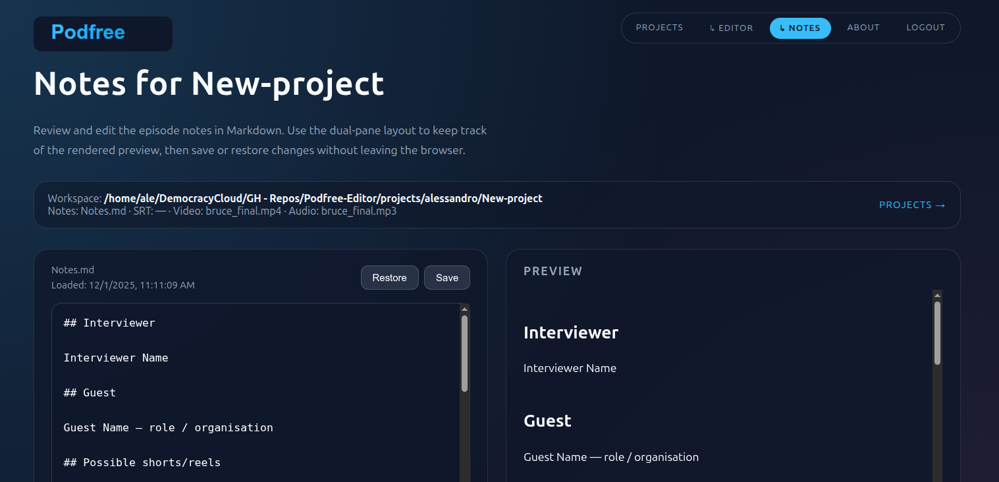

# Podfree Toolkit

> A complete podcast editing and automation platform with AI-powered tools for transcription, chapter generation, and multi-platform publishing.



**Repository:** [github.com/theRAGEhero/Podfree-Editor](https://github.com/theRAGEhero/Podfree-Editor)


---

## Table of Contents

- [Features Overview](#features-overview)
- [Screenshots](#screenshots)
- [Core Features](#core-features)
- [Layout](#layout)
- [Setup & Running](#setup--running-the-app)
- [Authentication](#authentication)
- [Script Execution](#script-execution)
- [Requirements](#requirements)
- [Docker Deployment](#docker-deployment-notes)

---

## Features Overview

Podfree combines video/audio editing, AI-powered automation, and multi-platform publishing into a single web-based interface. Edit transcripts, generate chapters, create social media posts, and publish to podcast platforms—all from one place.

### Key Highlights

- 🎬 **Video/Audio Editor** - Synchronized transcript editing with video playback, speaker diarization, and timeline markers
- 🤖 **AI-Powered Tools** - Automated chapter generation, title suggestions, summarization, and participant identification
- ✍️ **Markdown Notes** - Dual-pane editor with live preview for episode notes and metadata
- 📦 **Project Management** - Organize workspaces, upload files, and manage multiple podcast projects
- 🚀 **Multi-Platform Publishing** - One-click publishing to LinkedIn, Twitter, Mastodon, Bluesky, Ghost CMS, and Castopod
- 🎨 **Automated Workflows** - Batch processing, cover generation, silence removal, and subtitle creation
- 🔒 **Secure & Self-Hosted** - Authentication system with environment-based configuration

---

## Screenshots

### Project Management Dashboard

*Create projects, upload files (video, audio, transcripts, notes), and access editing tools*

### Transcript Editor

*Edit transcripts with synchronized video playback, speaker labels, timeline markers, and spectrogram visualization*

### Automation Toolbox

*Access AI-powered automation scripts for transcription, chapter generation, publishing, and more*

### Markdown Notes Editor

*Write and preview episode notes, chapters, metadata, and social media content with live Markdown rendering*

---

## Core Features

### 🎥 Editing Tools

#### Video/Audio Player
- Original video and lightweight proxy playback
- Synchronized transcript highlighting
- Spectrogram visualization with speaker color coding
- Speed controls, scrubbing, and timeline navigation
- Delete/skip markers and ad-hoc annotations

#### Transcript Editor
- Interactive transcript editing with video sync
- Speaker label management and diarization
- Timestamp synchronization
- Delete/skip segment markers
- Real-time updates and saving

#### Audio Processing
- Extract audio from video files
- Silence detection and removal
- Audio normalization
- Video splitting into segments

### 🤖 AI-Powered Automation

#### Transcription
- **Deepgram Integration** - Speech-to-text with automatic speaker diarization
- Multi-language support
- High-accuracy transcription with timestamps
- Deliberation JSON format output

#### Content Generation
- **Chapter Generation** - AI-generated chapter markers with titles and summaries
- **Title Suggestions** - Compelling episode title generation
- **Summarization** - Automatic episode summary creation
- **Participant Identification** - Extract interviewer/guest names from transcript
- **LinkedIn Post Drafting** - Social media content creation
- **Cover Image Generation** - Automated episode cover design

### 📤 Publishing & Distribution

#### Podcast Platforms
- **Castopod** - Complete integration with chapter export (Podcasting 2.0 JSON format)
- Chapter metadata with timestamps, titles, and descriptions
- Automated episode publishing

#### Social Media
- **LinkedIn** - Automated post creation and publishing to organization pages
- **Twitter/X** - Tweet generation and posting
- **Mastodon** - ActivityPub publishing
- **Bluesky** - AT Protocol social posting
- **Facebook** - Cross-posting support

#### Content Management
- **Ghost CMS** - Blog post creation with markdown content
- Automated excerpt and metadata generation
- Featured image handling

### 📁 Project Management

#### Workspace Organization
- Create and manage multiple podcast projects
- Upload files directly through browser (video, audio, transcripts, notes)
- Organize assets per project
- Quick access to player, editor, and notes
- Project summary with file statistics

#### File Management
- Automatic file detection and organization
- Support for multiple transcript formats
- Notes.md markdown files for episode metadata
- Cover images and generated assets storage

### 🛠️ Additional Tools

#### Editing Utilities
- **SRT Subtitle Generation** - Create subtitle files with smart text chunking
- **Silence Detection** - Find silent segments in audio
- **Video Splitting** - Cut video into segments based on timestamps
- **Transcription Fixing** - Clean up and correct transcript errors

#### Workflow Automation
- Batch processing scripts
- Run utilities from web UI or command line
- Live job execution logging
- Environment-based configuration

---

## Layout

Podfree bundles the episode automation scripts and the web UI into a single folder so you can review assets, run utilities, and edit notes without juggling files in the same directory.

```
Podfree/
├─ app/
│  ├─ server.py          # local web server powering the UI
│  └─ static/            # HTML/CSS/JS front-end (player + notes editor)
└─ scripts/              # automation scripts organized by function
   ├─ ai-tools/          # AI-powered features
   │  ├─ deepgram_transcribe_debates.py
   │  ├─ generate_chapters.py
   │  ├─ prepare_title.py
   │  ├─ identify_participants.py
   │  └─ summarization.py
   ├─ editing/           # Video/audio editing tools
   │  ├─ extract_audio_from_video.py
   │  ├─ generate_srt_subtitles.py
   │  ├─ silence_detection.py
   │  ├─ silence_removal.py
   │  └─ split_video.py
   ├─ publishing/        # Social media and publishing automation
   │  ├─ castopod_post.py
   │  ├─ export_castopod_chapters.py
   │  ├─ create_ghost_post.py
   │  ├─ prepare_linkedin_post.py
   │  └─ post_to_linkedin.py
   └─ utils/             # Shared utilities
      └─ llm_client.py
```

---

## Setup & Running the app

1. **(Recommended)** Create and activate a virtual environment, then install dependencies:
   ```bash
   cd Podfree
   python3 -m venv .venv
   source .venv/bin/activate  # On Windows: .venv\Scripts\activate
   pip install -U pip
   pip install -r requirements.txt
   ```
   This installs Pillow, Requests, Markdown, and the Deepgram SDK used by the automation scripts.

2. Duplicate the example environment file and configure your settings:
   ```bash
   cp .env.example .env
   # edit .env with your API keys and credentials
   ```

3. Start the server:
   ```bash
   python3 app/server.py --port 8000
   ```

4. Open `http://localhost:8000/projects.html` to create a project and upload assets (at minimum upload the video; notes, audio, and transcripts are optional and can be added later).

5. From the Projects page, click **Open in Player** or **Open in Notes** to activate that project as the current workspace.

---

## Authentication

The Podfree UI is gated by a lightweight login screen. Configure the credentials in the environment (or in a `.env` file) before starting the server:

```env
PODFREE_USERNAME=your_username
PODFREE_PASSWORD=your_password
DEEPGRAM_API_KEY=your_deepgram_key
```

### AI & Publishing Configuration

The chapter generator and other AI tools require an OpenRouter API key:

```env
OPENROUTER_API_KEY=sk-or-your-key
PODFREE_LLM_MODEL=deepseek/deepseek-r1
PODCAST_AUTHOR=Your Name
```

For LinkedIn publishing, configure OAuth credentials:

```env
LINKEDIN_CLIENT_ID=your_client_id
LINKEDIN_CLIENT_SECRET=your_client_secret
LINKEDIN_REDIRECT_URI=http://localhost:8005/linkedin/callback
```

For Ghost CMS publishing:

```env
GHOST_URL=https://yourblog.com
GHOST_ADMIN_API_KEY=your_admin_api_key
```

### LLM Model Selection

Most automation scripts use the model referenced by `PODFREE_LLM_MODEL`. Popular OpenRouter choices and their prices (USD per 1M tokens):

- `deepseek/deepseek-r1` — $0.42 input / $2.11 output (recommended)
- `anthropic/claude-3.7-sonnet` — $3.16 input / $15.79 output
- `anthropic/claude-3.5-haiku` — $0.84 input / $4.21 output

Override the model per command with `--model` if you need something different.

Restart `app/server.py` after updating the values. When you open the app you'll be redirected to `/login.html`; signing in takes you to the Projects dashboard. Use the **Logout** link in the header to end the session.

---

## Script execution

When you start a script from the UI, the server executes the corresponding file from `Podfree/scripts` with the workspace folder as the working directory. Any output (covers, JSON files, etc.) is generated right inside the workspace, so the assets stay together.

You can also run scripts manually from the command line:

```bash
cd Podfree/scripts/ai-tools
python3 generate_chapters.py --help
```

### Key Workflows

#### Automatic Chapter Generation

- Requires `OPENROUTER_API_KEY` in the environment
- Defaults to the latest Deepgram `Deliberation Json/*.json` transcript in the workspace
- Updates the `## Chapters` section in Notes.md
- Run manually: `python3 generate_chapters.py` or use the "Generate Chapters" button in the toolbox

#### Castopod Chapters Export

- Once Notes.md chapters look good, run `python3 export_castopod_chapters.py`
- Generates Podcasting 2.0 JSON from the `## Chapters` markdown bullets
- Format: `- [mm:ss] Title — summary` → `{"startTime": "mm:ss", "title": "...", "description": "..."}`
- Use with `castopod_post.py` or upload manually

#### LinkedIn Publishing Workflow

1. Run `python3 prepare_linkedin_post.py` to generate draft content in Notes.md
2. Edit the `## LinkedIn` section as needed
3. Run `python3 post_to_linkedin.py` to publish (use `--dry-run` to test)

#### Participant Name Extraction

- Run `python3 identify_participants.py` to infer interviewer/guest names from transcript
- Updates `## Interviewer` and `## Guest` sections in Notes.md
- Uses AI to identify speakers automatically

#### SRT Subtitle Generation

- Run `python3 generate_srt_subtitles.py` to create subtitle files
- Smart text chunking for readability (max 84 characters per subtitle)
- Proportional timing distribution
- Compatible with all major video players

---

## Requirements

- **Python 3.10+**
- **Dependencies:** `pillow`, `requests`, `markdown`, `deepgram-sdk`
- **Optional:** FFmpeg (for video/audio processing)
- **API Keys:** OpenRouter, Deepgram, LinkedIn, Ghost (depending on features used)

Install all requirements:
```bash
pip install -r requirements.txt
```

---

## Tips

- Use the **Projects page** to refresh after running scripts so the summary reflects new files
- The server **streams job logs** to the terminal for real-time progress monitoring
- The player falls back to the original MP4 automatically if the proxy is missing
- Run scripts with `--help` to see all available options and parameters
- Store API keys in `.env` file (never commit this file to version control!)

---

## Docker deployment notes

The container entrypoint now normalizes permissions on `/app/data`, `/app/logs`, and `/app/public` to UID/GID `1000`. When those paths are mounted as volumes, the directories are created and ownership is corrected automatically before the application starts.

Example Docker Compose configuration:

```yaml
version: '3.8'
services:
  podfree:
    build: .
    ports:
      - "8000:8000"
    volumes:
      - ./data:/app/data
      - ./logs:/app/logs
      - ./projects:/app/projects
    environment:
      - PODFREE_USERNAME=${PODFREE_USERNAME}
      - PODFREE_PASSWORD=${PODFREE_PASSWORD}
      - OPENROUTER_API_KEY=${OPENROUTER_API_KEY}
```

---

## License

MIT License - See LICENSE file for details

---

_Made with ♥ by [alexoppo.com](https://alexoppo.com)_
